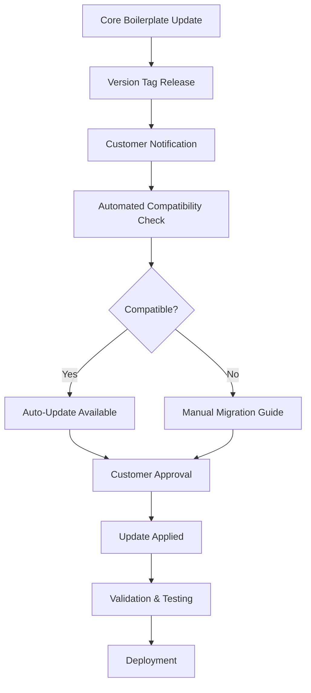

# 🔄 BOILERPLATE VERSIONING & UPDATE SYSTEM

## 🎯 OVERVIEW

Based on the successful customer implementation at [xlooop-ai/xlop-security](https://github.com/xlooop-ai/xlop-security), we need a robust system for:
1. **Version Management** - Semantic versioning for boilerplate updates
2. **Customer Isolation** - Preserve customer customizations during updates
3. **Automated Updates** - Seamless boilerplate improvements distribution
4. **Feedback Loop** - Customer innovations back to core boilerplate

---

## 🏗️ ARCHITECTURE OVERVIEW

### 📦 **Repository Structure**
```
# Core Boilerplate Repository (Maintained by us)
universal-sast-boilerplate/
├── core/                      # 🔒 Core functionality (version controlled)
├── templates/                 # 🎨 Template library (versioned)
├── .github/workflows/         # 🚀 Base workflows (updated regularly)
└── VERSION.json               # 📋 Version manifest

# Customer Implementation (Their repository)
customer-security-dashboard/
├── boilerplate-core/          # 📦 Git submodule → our repository
├── customer-extensions/       # 💡 Customer customizations
├── .customer-config.yml       # ⚙️ Customer-specific settings
├── .boilerplate-lock.json     # 🔒 Version lock file
└── package.json              # 📋 Customer dependencies
```

### 🔄 **Update Flow**


---

## 📋 VERSION MANAGEMENT SYSTEM

### 🏷️ **Semantic Versioning**
```json
{
  "version": "2.1.3",
  "release_date": "2024-12-22T10:00:00Z",
  "compatibility": {
    "min_customer_version": "1.5.0",
    "breaking_changes": false,
    "migration_required": false
  },
  "components": {
    "core": "2.1.3",
    "templates": "1.8.2", 
    "workflows": "2.0.1",
    "scripts": "1.9.0"
  },
  "changelog": {
    "added": [
      "GitHub Pages professional template",
      "Real-time data validation system",
      "Customer feedback collection API"
    ],
    "changed": [
      "Improved onboarding wizard performance",
      "Enhanced mobile responsiveness"
    ],
    "fixed": [
      "Template variable escaping in workflows",
      "Chart.js initialization timing issues"
    ],
    "deprecated": [
      "Legacy demo data system (removal in v3.0.0)"
    ]
  }
}
```

### 🔒 **Customer Lock File**
```json
// .boilerplate-lock.json
{
  "boilerplate_version": "2.1.3",
  "locked_at": "2024-12-22T10:00:00Z",
  "components": {
    "core": {
      "version": "2.1.3",
      "hash": "a1b2c3d4e5f6",
      "customizations": []
    },
    "templates": {
      "version": "1.8.2",
      "hash": "f6e5d4c3b2a1",
      "customizations": [
        "templates/github-pages/professional/assets/css/custom.css",
        "templates/github-pages/professional/assets/img/company-logo.png"
      ]
    },
    "workflows": {
      "version": "2.0.1", 
      "hash": "b2c3d4e5f6a1",
      "customizations": [
        ".github/workflows/custom-notifications.yml"
      ]
    }
  },
  "customer_extensions": [
    "customer-extensions/real-data-processor.js",
    "customer-extensions/slack-integration.js",
    "customer-extensions/custom-governance.yml"
  ],
  "last_update_check": "2024-12-22T10:00:00Z",
  "auto_update": {
    "enabled": true,
    "schedule": "weekly",
    "exclude_breaking": true
  }
}
```

---

## 🚀 AUTOMATED UPDATE SYSTEM

### 📡 **Update Check Workflow**
```yaml
# .github/workflows/boilerplate-update-check.yml
name: Boilerplate Update Check

on:
  schedule:
    - cron: '0 9 * * MON'  # Weekly on Monday
  workflow_dispatch:
    inputs:
      force_check:
        description: 'Force update check'
        required: false
        default: 'false'

jobs:
  check-updates:
    runs-on: ubuntu-latest
    outputs:
      update_available: ${{ steps.check.outputs.update_available }}
      new_version: ${{ steps.check.outputs.new_version }}
      current_version: ${{ steps.check.outputs.current_version }}
      breaking_changes: ${{ steps.check.outputs.breaking_changes }}
    
    steps:
      - name: Checkout repository
        uses: actions/checkout@v4
        with:
          submodules: true
      
      - name: Check for updates
        id: check
        run: |
          # Get current version from lock file
          CURRENT_VERSION=$(jq -r '.boilerplate_version' .boilerplate-lock.json)
          
          # Check latest version from boilerplate repository
          LATEST_VERSION=$(curl -s https://api.github.com/repos/universal-sast/boilerplate-core/releases/latest | jq -r '.tag_name')
          
          echo "current_version=$CURRENT_VERSION" >> $GITHUB_OUTPUT
          echo "new_version=$LATEST_VERSION" >> $GITHUB_OUTPUT
          
          if [[ "$CURRENT_VERSION" != "$LATEST_VERSION" ]]; then
            echo "update_available=true" >> $GITHUB_OUTPUT
            
            # Check for breaking changes
            RELEASE_NOTES=$(curl -s https://api.github.com/repos/universal-sast/boilerplate-core/releases/latest | jq -r '.body')
            if echo "$RELEASE_NOTES" | grep -i "breaking"; then
              echo "breaking_changes=true" >> $GITHUB_OUTPUT
            else
              echo "breaking_changes=false" >> $GITHUB_OUTPUT
            fi
          else
            echo "update_available=false" >> $GITHUB_OUTPUT
          fi

  compatibility-check:
    needs: check-updates
    if: needs.check-updates.outputs.update_available == 'true'
    runs-on: ubuntu-latest
    outputs:
      compatible: ${{ steps.compatibility.outputs.compatible }}
      migration_required: ${{ steps.compatibility.outputs.migration_required }}
    
    steps:
      - name: Checkout repository
        uses: actions/checkout@v4
        with:
          submodules: true
      
      - name: Compatibility analysis
        id: compatibility
        run: |
          # Download new version metadata
          curl -s https://raw.githubusercontent.com/universal-sast/boilerplate-core/${{ needs.check-updates.outputs.new_version }}/VERSION.json > new-version.json
          
          # Check compatibility
          MIN_CUSTOMER_VERSION=$(jq -r '.compatibility.min_customer_version' new-version.json)
          CURRENT_CUSTOMER_VERSION=$(jq -r '.customer_version // "1.0.0"' .boilerplate-lock.json)
          
          # Simple version comparison (in real implementation, use semantic version library)
          if [[ "$CURRENT_CUSTOMER_VERSION" < "$MIN_CUSTOMER_VERSION" ]]; then
            echo "compatible=false" >> $GITHUB_OUTPUT
            echo "migration_required=true" >> $GITHUB_OUTPUT
          else
            echo "compatible=true" >> $GITHUB_OUTPUT
            MIGRATION_REQUIRED=$(jq -r '.compatibility.migration_required' new-version.json)
            echo "migration_required=$MIGRATION_REQUIRED" >> $GITHUB_OUTPUT
          fi

  auto-update:
    needs: [check-updates, compatibility-check]
    if: |
      needs.check-updates.outputs.update_available == 'true' && 
      needs.compatibility-check.outputs.compatible == 'true' &&
      needs.check-updates.outputs.breaking_changes == 'false'
    runs-on: ubuntu-latest
    
    steps:
      - name: Checkout repository
        uses: actions/checkout@v4
        with:
          submodules: true
          token: ${{ secrets.GITHUB_TOKEN }}
      
      - name: Setup Node.js
        uses: actions/setup-node@v4
        with:
          node-version: '20'
      
      - name: Backup current state
        run: |
          mkdir -p backups/$(date +%Y%m%d_%H%M%S)
          cp -r boilerplate-core/ backups/$(date +%Y%m%d_%H%M%S)/core-backup/
          cp .boilerplate-lock.json backups/$(date +%Y%m%d_%H%M%S)/
      
      - name: Update boilerplate core
        run: |
          cd boilerplate-core
          git fetch origin
          git checkout ${{ needs.check-updates.outputs.new_version }}
          cd ..
          git add boilerplate-core
      
      - name: Preserve customizations
        run: |
          # Run customization preservation script
          node scripts/preserve-customizations.js \
            --old-version=${{ needs.check-updates.outputs.current_version }} \
            --new-version=${{ needs.check-updates.outputs.new_version }}
      
      - name: Update lock file
        run: |
          # Update version information
          jq --arg version "${{ needs.check-updates.outputs.new_version }}" \
             --arg timestamp "$(date -u +%Y-%m-%dT%H:%M:%SZ)" \
             '.boilerplate_version = $version | .locked_at = $timestamp' \
             .boilerplate-lock.json > .boilerplate-lock.json.tmp
          mv .boilerplate-lock.json.tmp .boilerplate-lock.json
      
      - name: Test updated configuration
        run: |
          # Run validation tests
          npm test
          
          # Test dashboard generation
          node scripts/generate-dashboard.js --dry-run
      
      - name: Create pull request
        uses: peter-evans/create-pull-request@v5
        with:
          token: ${{ secrets.GITHUB_TOKEN }}
          title: "🔄 Auto-update boilerplate to v${{ needs.check-updates.outputs.new_version }}"
          body: |
            ## 🚀 Boilerplate Auto-Update
            
            **New Version**: v${{ needs.check-updates.outputs.new_version }}
            **Current Version**: v${{ needs.check-updates.outputs.current_version }}
            **Breaking Changes**: ${{ needs.check-updates.outputs.breaking_changes }}
            **Migration Required**: ${{ needs.compatibility-check.outputs.migration_required }}
            
            ### 🔄 Changes Applied
            - Updated boilerplate core to latest version
            - Preserved all customer customizations
            - Updated version lock file
            - Validated configuration compatibility
            
            ### ✅ Validation Status
            - [x] Compatibility check passed
            - [x] Customizations preserved
            - [x] Tests passed
            - [x] Dashboard generation verified
            
            ### 📋 Next Steps
            1. Review the changes
            2. Test the updated dashboard
            3. Merge if everything looks good
            4. The dashboard will auto-deploy after merge
            
            ---
            *This PR was automatically created by the boilerplate update system.*
          branch: boilerplate-update-v${{ needs.check-updates.outputs.new_version }}
          delete-branch: true

  notify-manual-update:
    needs: [check-updates, compatibility-check]
    if: |
      needs.check-updates.outputs.update_available == 'true' && 
      (needs.compatibility-check.outputs.compatible == 'false' || 
       needs.check-updates.outputs.breaking_changes == 'true')
    runs-on: ubuntu-latest
    
    steps:
      - name: Create manual update issue
        uses: actions/github-script@v7
        with:
          script: |
            github.rest.issues.create({
              owner: context.repo.owner,
              repo: context.repo.repo,
              title: `⚠️ Manual boilerplate update required: v${{ needs.check-updates.outputs.new_version }}`,
              body: `## 🚨 Manual Update Required

**New Version**: v${{ needs.check-updates.outputs.new_version }}
**Current Version**: v${{ needs.check-updates.outputs.current_version }}
**Breaking Changes**: ${{ needs.check-updates.outputs.breaking_changes }}
**Compatible**: ${{ needs.compatibility-check.outputs.compatible }}

### 🔍 Why Manual Update?
${needs.check-updates.outputs.breaking_changes === 'true' ? '- ⚠️ Breaking changes detected' : ''}
${needs.compatibility-check.outputs.compatible === 'false' ? '- ❌ Compatibility issues found' : ''}

### 📋 Manual Update Steps
1. Review the [release notes](https://github.com/universal-sast/boilerplate-core/releases/tag/${{ needs.check-updates.outputs.new_version }})
2. Check the [migration guide](https://github.com/universal-sast/boilerplate-core/blob/main/MIGRATION.md)
3. Follow the manual update process
4. Test thoroughly before deployment

### 🔗 Resources
- [Release Notes](https://github.com/universal-sast/boilerplate-core/releases/tag/${{ needs.check-updates.outputs.new_version }})
- [Migration Guide](https://github.com/universal-sast/boilerplate-core/blob/main/MIGRATION.md)
- [Update Documentation](https://github.com/universal-sast/boilerplate-core/blob/main/docs/UPDATING.md)

---
*This issue was automatically created by the boilerplate update system.*`,
              labels: ['boilerplate-update', 'manual-update-required']
            })
```

---

## 🔧 CUSTOMIZATION PRESERVATION SYSTEM

### 💾 **Customization Detection**
```javascript
// scripts/preserve-customizations.js
const fs = require('fs');
const path = require('path');
const crypto = require('crypto');
const { execSync } = require('child_process');

class CustomizationPreserver {
    constructor(oldVersion, newVersion) {
        this.oldVersion = oldVersion;
        this.newVersion = newVersion;
        this.lockFile = this.loadLockFile();
        this.customizations = new Map();
    }
    
    async preserveCustomizations() {
        console.log('🔍 Detecting customizations...');
        
        // Detect modified files
        await this.detectModifiedFiles();
        
        // Preserve customer extensions
        await this.preserveExtensions();
        
        // Merge configuration changes
        await this.mergeConfigurations();
        
        // Update lock file
        await this.updateLockFile();
        
        console.log('✅ Customizations preserved successfully!');
    }
    
    async detectModifiedFiles() {
        const lockFile = this.lockFile;
        
        for (const [component, info] of Object.entries(lockFile.components)) {
            console.log(`🔍 Checking ${component} customizations...`);
            
            // Get list of files in component
            const componentPath = this.getComponentPath(component);
            const files = this.getAllFiles(componentPath);
            
            for (const file of files) {
                const currentHash = this.getFileHash(file);
                const originalHash = this.getOriginalFileHash(file, info.version);
                
                if (currentHash !== originalHash) {
                    console.log(`📝 Found customization: ${file}`);
                    this.customizations.set(file, {
                        type: 'modified',
                        component: component,
                        currentHash: currentHash,
                        originalHash: originalHash
                    });
                }
            }
        }
    }
    
    async preserveExtensions() {
        const extensions = this.lockFile.customer_extensions || [];
        
        for (const extension of extensions) {
            if (fs.existsSync(extension)) {
                console.log(`💾 Preserving extension: ${extension}`);
                this.customizations.set(extension, {
                    type: 'extension',
                    preserved: true
                });
            }
        }
    }
    
    async mergeConfigurations() {
        // Merge customer-config.yml with new template defaults
        const customerConfig = this.loadCustomerConfig();
        const newDefaults = this.loadNewDefaults();
        
        const mergedConfig = this.deepMerge(newDefaults, customerConfig);
        this.saveCustomerConfig(mergedConfig);
        
        console.log('⚙️ Configuration merged successfully');
    }
    
    async updateLockFile() {
        // Update lock file with new version information
        const newLockFile = {
            ...this.lockFile,
            boilerplate_version: this.newVersion,
            locked_at: new Date().toISOString(),
            components: this.updateComponentVersions(),
            customizations_preserved: Array.from(this.customizations.keys())
        };
        
        fs.writeFileSync('.boilerplate-lock.json', JSON.stringify(newLockFile, null, 2));
        console.log('🔒 Lock file updated');
    }
    
    getFileHash(filePath) {
        if (!fs.existsSync(filePath)) return null;
        const content = fs.readFileSync(filePath);
        return crypto.createHash('sha256').update(content).digest('hex');
    }
    
    getOriginalFileHash(filePath, version) {
        try {
            // Get original file from git history
            const originalContent = execSync(
                `git show ${version}:${filePath}`,
                { encoding: 'utf8' }
            );
            return crypto.createHash('sha256').update(originalContent).digest('hex');
        } catch {
            return null;
        }
    }
    
    deepMerge(target, source) {
        for (const key in source) {
            if (source[key] && typeof source[key] === 'object' && !Array.isArray(source[key])) {
                if (!target[key]) target[key] = {};
                this.deepMerge(target[key], source[key]);
            } else {
                target[key] = source[key];
            }
        }
        return target;
    }
}

// CLI interface
if (require.main === module) {
    const { oldVersion, newVersion } = require('minimist')(process.argv.slice(2));
    const preserver = new CustomizationPreserver(oldVersion, newVersion);
    preserver.preserveCustomizations().catch(console.error);
}
```

### 🎯 **Smart Merge System**
```javascript
// scripts/smart-merge.js
class SmartMerger {
    constructor() {
        this.mergeStrategies = new Map();
        this.setupDefaultStrategies();
    }
    
    setupDefaultStrategies() {
        // YAML configuration files
        this.mergeStrategies.set('*.yml', this.mergeYamlFiles.bind(this));
        this.mergeStrategies.set('*.yaml', this.mergeYamlFiles.bind(this));
        
        // JavaScript files
        this.mergeStrategies.set('*.js', this.mergeJavaScriptFiles.bind(this));
        
        // CSS files
        this.mergeStrategies.set('*.css', this.mergeCssFiles.bind(this));
        
        // HTML templates
        this.mergeStrategies.set('*.html', this.mergeHtmlFiles.bind(this));
        
        // GitHub workflows
        this.mergeStrategies.set('.github/workflows/*.yml', this.mergeWorkflows.bind(this));
    }
    
    async mergeFile(filePath, oldContent, newContent, customerContent) {
        const strategy = this.getStrategy(filePath);
        
        if (strategy) {
            return await strategy(filePath, oldContent, newContent, customerContent);
        } else {
            // Default three-way merge
            return this.defaultMerge(oldContent, newContent, customerContent);
        }
    }
    
    async mergeYamlFiles(filePath, oldContent, newContent, customerContent) {
        const yaml = require('js-yaml');
        
        try {
            const oldData = yaml.load(oldContent) || {};
            const newData = yaml.load(newContent) || {};
            const customerData = yaml.load(customerContent) || {};
            
            // Preserve customer configurations while applying new defaults
            const merged = this.deepMergeWithPriority(newData, oldData, customerData);
            
            return yaml.dump(merged, { 
                indent: 2,
                lineWidth: -1,
                noRefs: true
            });
        } catch (error) {
            console.warn(`⚠️ YAML merge failed for ${filePath}, using customer version`);
            return customerContent;
        }
    }
    
    async mergeJavaScriptFiles(filePath, oldContent, newContent, customerContent) {
        // For JavaScript files, we need to be more careful
        // Look for specific patterns that indicate customizations
        
        const customFunctions = this.extractCustomFunctions(customerContent, oldContent);
        const newBase = newContent;
        
        if (customFunctions.length > 0) {
            // Insert custom functions into new base
            return this.insertCustomFunctions(newBase, customFunctions);
        }
        
        return newContent; // Use new version if no customizations detected
    }
    
    async mergeWorkflows(filePath, oldContent, newContent, customerContent) {
        const yaml = require('js-yaml');
        
        const oldWorkflow = yaml.load(oldContent) || {};
        const newWorkflow = yaml.load(newContent) || {};
        const customerWorkflow = yaml.load(customerContent) || {};
        
        // Preserve customer job additions and environment variables
        const mergedWorkflow = {
            ...newWorkflow,
            env: { ...newWorkflow.env, ...customerWorkflow.env },
            jobs: this.mergeWorkflowJobs(oldWorkflow.jobs, newWorkflow.jobs, customerWorkflow.jobs)
        };
        
        return yaml.dump(mergedWorkflow, { indent: 2 });
    }
    
    deepMergeWithPriority(newData, oldData, customerData) {
        // Priority: Customer customizations > New defaults > Old defaults
        const result = { ...newData };
        
        // Apply customer customizations
        for (const [key, value] of Object.entries(customerData)) {
            if (typeof value === 'object' && value !== null && !Array.isArray(value)) {
                if (typeof newData[key] === 'object' && newData[key] !== null) {
                    result[key] = this.deepMergeWithPriority(newData[key], oldData[key] || {}, value);
                } else {
                    result[key] = value; // Customer addition
                }
            } else {
                // Check if this is a customer customization
                if (JSON.stringify(value) !== JSON.stringify(oldData[key])) {
                    result[key] = value; // Preserve customer change
                }
                // Otherwise, keep new default
            }
        }
        
        return result;
    }
}
```

---

## 📊 CUSTOMER FEEDBACK INTEGRATION

### 🔄 **Feedback Collection API**
```javascript
// scripts/feedback-collector.js
class FeedbackCollector {
    constructor() {
        this.feedbackEndpoint = 'https://api.universal-sast.com/feedback';
        this.anonymousId = this.generateAnonymousId();
    }
    
    async collectUsageMetrics() {
        const metrics = {
            timestamp: new Date().toISOString(),
            customer_id: this.anonymousId,
            boilerplate_version: this.getBoilerplateVersion(),
            
            // Usage patterns
            usage: {
                template_type: this.getTemplateType(),
                scanners_used: this.getActiveScanners(),
                notification_channels: this.getNotificationChannels(),
                github_pages_enabled: this.isGitHubPagesEnabled(),
                custom_extensions: this.getCustomExtensions().length
            },
            
            // Performance metrics
            performance: {
                setup_duration: this.getSetupDuration(),
                scan_duration: await this.getAverageScanDuration(),
                dashboard_load_time: await this.measureDashboardLoadTime(),
                false_positive_rate: await this.calculateFalsePositiveRate()
            },
            
            // Feature adoption
            features: {
                real_data_validation: this.isRealDataValidationUsed(),
                governance_policies: this.isGovernanceEnabled(),
                compliance_frameworks: this.getComplianceFrameworks(),
                custom_processors: this.getCustomProcessors().length
            },
            
            // Satisfaction indicators
            satisfaction: {
                setup_difficulty: await this.estimateSetupDifficulty(),
                documentation_quality: await this.estimateDocumentationUsage(),
                feature_completeness: await this.assessFeatureCompleteness()
            }
        };
        
        return metrics;
    }
    
    async submitFeedback(metrics) {
        try {
            const response = await fetch(this.feedbackEndpoint, {
                method: 'POST',
                headers: {
                    'Content-Type': 'application/json',
                    'User-Agent': 'Universal-SAST-Boilerplate-Client/1.0'
                },
                body: JSON.stringify(metrics)
            });
            
            if (response.ok) {
                console.log('📊 Feedback submitted successfully');
                return true;
            } else {
                console.warn('⚠️ Failed to submit feedback:', response.status);
                return false;
            }
        } catch (error) {
            console.warn('⚠️ Feedback submission failed:', error.message);
            return false;
        }
    }
    
    async generateImprovementSuggestions() {
        const metrics = await this.collectUsageMetrics();
        const suggestions = [];
        
        // Performance suggestions
        if (metrics.performance.scan_duration > 600) { // > 10 minutes
            suggestions.push({
                type: 'performance',
                priority: 'high',
                suggestion: 'Consider enabling scan result caching to improve performance',
                estimated_improvement: '40% faster scans'
            });
        }
        
        // Feature adoption suggestions
        if (!metrics.usage.github_pages_enabled) {
            suggestions.push({
                type: 'feature',
                priority: 'medium',
                suggestion: 'Enable GitHub Pages for team dashboard access',
                benefits: ['Improved team visibility', 'Stakeholder reporting']
            });
        }
        
        // Security suggestions
        if (metrics.features.false_positive_rate > 0.2) { // > 20%
            suggestions.push({
                type: 'accuracy',
                priority: 'high',
                suggestion: 'Tune scanner rules to reduce false positives',
                estimated_improvement: 'Reduce noise by 50%'
            });
        }
        
        return suggestions;
    }
}
```

### 📈 **Innovation Tracking**
```yaml
# .github/workflows/innovation-tracking.yml
name: Innovation Tracking

on:
  push:
    paths:
      - 'customer-extensions/**'
      - '.customer-config.yml'
  pull_request:
    paths:
      - 'customer-extensions/**'
  workflow_dispatch:

jobs:
  track-innovations:
    runs-on: ubuntu-latest
    steps:
      - name: Checkout repository
        uses: actions/checkout@v4
        
      - name: Analyze customer innovations
        run: |
          # Detect new customer extensions
          NEW_EXTENSIONS=$(find customer-extensions/ -name "*.js" -o -name "*.yml" -newer .boilerplate-lock.json || echo "none")
          
          if [[ "$NEW_EXTENSIONS" != "none" ]]; then
            echo "💡 New customer innovations detected:"
            echo "$NEW_EXTENSIONS"
            
            # Generate innovation report
            cat > innovation-report.json << EOF
            {
              "timestamp": "$(date -u +%Y-%m-%dT%H:%M:%SZ)",
              "repository": "${{ github.repository }}",
              "innovations": [
            $(echo "$NEW_EXTENSIONS" | while read -r file; do
              if [[ -n "$file" ]]; then
                echo "    {"
                echo "      \"file\": \"$file\","
                echo "      \"type\": \"$(basename "$file" | cut -d. -f2)\","
                echo "      \"size\": $(wc -l < "$file"),"
                echo "      \"description\": \"$(head -3 "$file" | grep -o '//.*' | head -1 | sed 's|^//||' || echo 'Custom extension')\""
                echo "    },"
              fi
            done | sed '$ s/,$//')
              ]
            }
            EOF
            
            # Submit innovation report to boilerplate maintainers
            curl -X POST \
              -H "Content-Type: application/json" \
              -H "Authorization: token ${{ secrets.FEEDBACK_TOKEN }}" \
              -d @innovation-report.json \
              https://api.github.com/repos/universal-sast/boilerplate-core/issues \
              --data '{"title": "💡 Customer Innovation Report from ${{ github.repository }}", "body": "See attached innovation report", "labels": ["customer-innovation"]}'
          fi
          
      - name: Update innovation tracking
        run: |
          # Update lock file with innovation tracking
          jq --arg timestamp "$(date -u +%Y-%m-%dT%H:%M:%SZ)" \
             '.last_innovation_check = $timestamp' \
             .boilerplate-lock.json > .boilerplate-lock.json.tmp
          mv .boilerplate-lock.json.tmp .boilerplate-lock.json
```

---

## 📋 MIGRATION GUIDE SYSTEM

### 📚 **Automated Migration Documentation**
```javascript
// scripts/generate-migration-guide.js
class MigrationGuideGenerator {
    constructor(fromVersion, toVersion) {
        this.fromVersion = fromVersion;
        this.toVersion = toVersion;
        this.changes = [];
    }
    
    async generateGuide() {
        console.log(`📚 Generating migration guide: ${this.fromVersion} → ${this.toVersion}`);
        
        // Analyze changes between versions
        await this.analyzeVersionChanges();
        
        // Generate step-by-step guide
        const guide = this.createMigrationGuide();
        
        // Save guide
        fs.writeFileSync(`migration-${this.fromVersion}-to-${this.toVersion}.md`, guide);
        
        console.log('✅ Migration guide generated successfully!');
    }
    
    async analyzeVersionChanges() {
        // Get changelog from new version
        const changelog = await this.getChangelog(this.toVersion);
        
        // Analyze breaking changes
        this.analyzeBreakingChanges(changelog);
        
        // Analyze configuration changes
        this.analyzeConfigurationChanges();
        
        // Analyze dependency changes
        this.analyzeDependencyChanges();
    }
    
    createMigrationGuide() {
        return `# 🔄 Migration Guide: ${this.fromVersion} → ${this.toVersion}

## 📋 Overview

This guide will help you migrate your SAST boilerplate from version ${this.fromVersion} to ${this.toVersion}.

**Estimated Time**: ${this.estimateMigrationTime()} minutes
**Difficulty**: ${this.estimateDifficulty()}
**Breaking Changes**: ${this.hasBreakingChanges() ? 'Yes ⚠️' : 'No ✅'}

## 🚨 Pre-Migration Checklist

- [ ] **Backup your current setup**
  \`\`\`bash
  mkdir -p backups/$(date +%Y%m%d)
  cp -r . backups/$(date +%Y%m%d)/
  \`\`\`

- [ ] **Review your customizations**
  \`\`\`bash
  node scripts/list-customizations.js
  \`\`\`

- [ ] **Test your current setup**
  \`\`\`bash
  npm test
  node scripts/validate-dashboard.js
  \`\`\`

## 📋 Migration Steps

### Step 1: Update Boilerplate Core

\`\`\`bash
# Update submodule to new version
cd boilerplate-core
git fetch origin
git checkout ${this.toVersion}
cd ..
git add boilerplate-core
\`\`\`

### Step 2: Migrate Configuration

${this.generateConfigurationMigrationSteps()}

### Step 3: Update Dependencies

\`\`\`bash
# Update package.json dependencies
npm update
\`\`\`

### Step 4: Migrate Custom Extensions

${this.generateExtensionMigrationSteps()}

### Step 5: Test Migration

\`\`\`bash
# Validate configuration
node scripts/validate-config.js

# Test dashboard generation
node scripts/generate-dashboard.js --dry-run

# Run full test suite
npm test
\`\`\`

### Step 6: Deploy Updated Dashboard

\`\`\`bash
# Commit changes
git add .
git commit -m "Migrate to boilerplate v${this.toVersion}"

# Deploy
git push origin main
\`\`\`

## 🔧 Troubleshooting

${this.generateTroubleshootingSection()}

## 🆘 Getting Help

If you encounter issues during migration:

1. **Check the troubleshooting section above**
2. **Review the [full changelog](https://github.com/universal-sast/boilerplate-core/releases/tag/${this.toVersion})**
3. **Search existing [migration issues](https://github.com/universal-sast/boilerplate-core/issues?q=label%3Amigration)**
4. **Create a new issue** with your specific problem

---

*This migration guide was automatically generated for your specific setup.*`;
    }
    
    generateConfigurationMigrationSteps() {
        let steps = '';
        
        for (const change of this.changes.filter(c => c.type === 'configuration')) {
            steps += `
#### ${change.title}

${change.description}

\`\`\`bash
${change.command}
\`\`\`
`;
        }
        
        return steps || '✅ No configuration changes required.';
    }
}
```

---

**🎯 NEXT SESSION FOCUS**: Implement customer feedback collection system and create automated boilerplate improvement pipeline based on usage patterns.**
