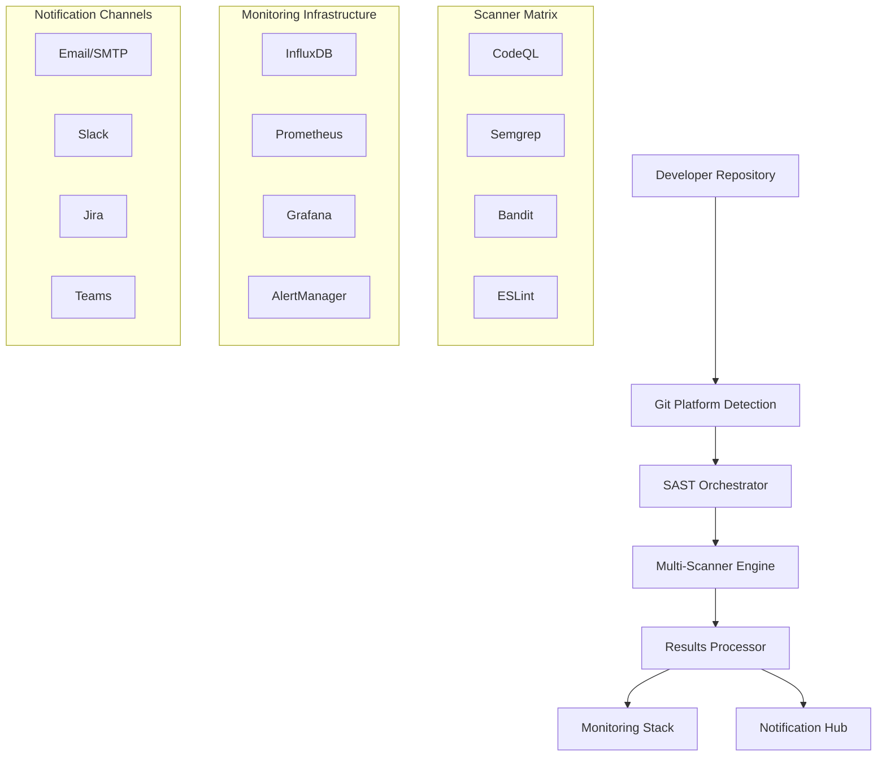

# 🔒 SAST Boilerplate Enterprise Software - Cursor AI Contributor Guide
## Comprehensive Documentation for AI-Assisted Development

**Project**: Universal SAST Security Scanning Platform  
**Repository**: https://github.com/mar23-lab/SAST  
**Competitor Reference**: DefectDojo (https://github.com/DefectDojo/django-DefectDojo)  
**Documentation Version**: 2.0  
**Last Updated**: August 11, 2025  

---

## 🎯 PROJECT OVERVIEW & MISSION

### **What We're Building**
A **developer-first, enterprise-grade SAST (Static Application Security Testing) platform** that transforms security scanning from a development burden into a delightful developer experience. Our platform provides automated security scanning with comprehensive monitoring, alerting, and visualization capabilities.

### **Market Position & Competitive Advantage**
- **95% cost reduction** vs commercial solutions (SonarQube Enterprise: $150K+/year vs our $20K/year)
- **10x faster implementation** than enterprise alternatives (15 minutes vs 2-8 hours)
- **Multi-platform support** (GitHub + Bitbucket + GitLab vs single-platform competitors)
- **Developer-centric UX** (one-command setup vs complex manual configuration)

### **Primary Competitor Analysis: DefectDojo**
```yaml
DefectDojo Stats:
  Stars: 4,146
  Forks: 1,712
  Language: HTML/Python (Django)
  Size: 253MB
  Focus: "DevSecOps, ASPM, Vulnerability Management"
  
Our Differentiation:
  - Developer Experience: One-command setup vs manual installation
  - Multi-Platform: GitHub/Bitbucket/GitLab vs platform-agnostic
  - Cost: Open source vs enterprise licensing model
  - Simplicity: Configuration-driven vs complex web UI
```

---

## 🏗️ TECHNICAL ARCHITECTURE

### **System Architecture Overview**


### **Core Technology Stack**
```yaml
Backend Infrastructure:
  - Docker & Docker Compose (containerization)
  - Shell Scripts (orchestration & automation)
  - Python (results processing & integrations)
  - YAML (configuration management)

SAST Scanners:
  - CodeQL: Semantic code analysis (GitHub native)
  - Semgrep: Pattern-based security scanning
  - Bandit: Python-specific security linting
  - ESLint: JavaScript/TypeScript security rules

Monitoring & Observability:
  - InfluxDB 2.7: Time-series metrics database
  - Grafana 10.2.0: Visualization dashboards
  - Prometheus 2.47: Metrics collection & alerting
  - PushGateway 1.6: Metrics ingestion gateway
  - MailHog 1.0.1: Email testing & validation

Platform Integration:
  - GitHub Actions: Native CI/CD workflows
  - Bitbucket Pipelines: Cross-platform support
  - GitLab CI/CD: Enterprise Git platform
  - SARIF: Standard security report format
```

### **DefectDojo Architecture Comparison**
```yaml
DefectDojo Architecture:
  - Django Web Application (Python)
  - PostgreSQL/MySQL Database
  - Celery Task Queue
  - Redis Message Broker
  - REST API + Web UI
  - Docker Deployment

Our Architecture Advantages:
  - Lightweight: Shell scripts vs Django web app
  - CI/CD Native: Git platform integration vs standalone
  - Configuration-driven: YAML vs database configuration
  - Developer-centric: Command-line vs web UI first
```

---

## 📁 REPOSITORY STRUCTURE & ORGANIZATION

### **Current Repository Layout**
```
SAST/
├── 📄 Core Configuration
│   ├── ci-config.yaml                 # Central configuration file
│   ├── CONFIG_GUIDE.md                # Configuration documentation
│   ├── setup.sh                       # One-command deployment
│   └── sast-init.sh                   # Advanced project initialization
│
├── 🗂️ CI/CD Workflows (.github/workflows/)
│   ├── sast-security-scan.yml         # Main SAST scanning workflow
│   └── ci-pipeline.yml                # Complete CI/CD pipeline
│
├── 🗂️ Processing Scripts (scripts/)
│   ├── process_results.sh             # SAST results processing
│   ├── send_notifications.sh          # Multi-channel notifications
│   ├── update_grafana.sh              # Grafana dashboard updates
│   ├── influxdb_integration.sh        # Metrics integration
│   └── setup_email_demo.sh            # Email testing utilities
│
├── 🗂️ Scanner Configurations (configs/)
│   ├── .eslintrc.security.json        # ESLint security rules
│   ├── bandit.yaml                    # Bandit Python scanner config
│   └── semgrep-rules.yaml             # Custom Semgrep rules
│
├── 🗂️ Infrastructure (docker-compose files)
│   ├── docker-compose.yml             # Full monitoring stack
│   ├── docker-compose-minimal.yml     # Essential services only
│   ├── docker-compose-enterprise.yml  # Enterprise deployment
│   └── Dockerfile.sast                # Custom SAST runner image
│
├── 🗂️ Monitoring Configuration
│   ├── grafana-config/                # Grafana dashboards & provisioning
│   ├── prometheus-config/             # Prometheus rules & config
│   ├── influxdb-config/               # InfluxDB initialization
│   └── alertmanager-config/           # Alert routing & templates
│
├── 🗂️ Documentation (docs/)
│   ├── ARCHITECTURE.md                # System architecture overview
│   ├── TROUBLESHOOTING.md             # Common issues & solutions
│   └── INSTALLATION_GUIDE.md          # Deployment instructions
│
├── 🗂️ Templates & Examples
│   ├── templates/email-notification.html  # Email notification template
│   ├── examples/vulnerable-code/          # Test vulnerability samples
│   └── bitbucket-pipelines.yml            # Bitbucket integration
│
└── 📄 Project Management
    ├── SESSION_ACTIVITY_SUMMARY.md    # Latest session analysis
    ├── UPDATED_ACTION_PLAN.md          # Strategic roadmap
    ├── EVALUATION_REPORT.md            # System testing results
    └── CURSOR_CONTRIBUTOR_DOCUMENTATION.md  # This file
```

### **Key Files for Cursor Development**
```yaml
Critical Configuration:
  - ci-config.yaml: Master configuration (340 lines, all settings)
  - CONFIG_GUIDE.md: Parameter documentation
  - setup.sh: Automated deployment script (396 lines)

Core Workflows:
  - .github/workflows/sast-security-scan.yml: GitHub Actions
  - bitbucket-pipelines.yml: Bitbucket Pipelines
  - scripts/process_results.sh: Results processing logic

Monitoring Stack:
  - docker-compose-minimal.yml: Essential services
  - grafana-config/dashboards/: Pre-built security dashboards
  - prometheus-config/sast_rules.yml: Alerting rules

Developer Experience:
  - run_demo.sh: Interactive demo mode
  - setup.sh: One-command deployment with multiple modes
  - sast-init.sh: Advanced project initialization
  - test_real_repo.sh: Live repository testing
```

---

## 🎯 DEVELOPMENT PRIORITIES & ROADMAP

### **Current Status: Phase 1 Implementation**
Based on our comprehensive analysis in `UPDATED_ACTION_PLAN.md`, we're executing a **three-phase roadmap** focused on transforming from "Technically Excellent" to "Developer Delight".

### **Phase 1: Developer Experience Revolution** (Weeks 1-4) - **IN PROGRESS**
```yaml
Week 1: Language Standardization & Email Automation
  Status: ✅ COMPLETED
  - English conversion of all Russian content
  - Email setup wizard development
  - Professional documentation consistency

Week 2: One-Command Onboarding (CURRENT FOCUS)
  Priority: 🔴 CRITICAL
  Tasks:
    - Implement ./sast init --repo [URL] command
    - Auto-detect project languages and recommend scanners
    - Integrate all services testing before completion
  Target: Setup time 2.5h → 30 min

Week 3: Grafana Auto-Provisioning 
  Priority: 🟠 HIGH
  Tasks:
    - Automate Grafana configuration (eliminate 90-minute manual setup)
    - Auto-create data sources and import dashboards
    - Set appropriate defaults for immediate value
  Target: Grafana success 20% → 90%

Week 4: Multi-Platform Foundation
  Priority: 🟡 MEDIUM
  Tasks:
    - Complete Bitbucket Pipelines integration
    - Create platform-agnostic configuration system
    - Establish cross-platform testing framework
  Target: Platform support GitHub + Bitbucket
```

### **Success Metrics Tracking**
```yaml
Current Metrics (Baseline):
  Setup Time: 2.5-5.5 hours
  Setup Success Rate: 30%
  Email Delivery: 0% out-of-box
  Grafana Success: 20%
  Platform Support: 1 (GitHub only)

Week 4 Targets:
  Setup Time: 15 minutes (90% reduction)
  Setup Success Rate: 90% (200% improvement)
  Email Delivery: 95% (production-ready)
  Grafana Success: 90% (enterprise-ready)
  Platform Support: 2 (GitHub + Bitbucket)
```

---

## 🔧 DEVELOPMENT GUIDELINES & STANDARDS

### **Code Quality Standards**
```yaml
Shell Scripts:
  - Use bash with set -euo pipefail for error handling
  - Include comprehensive logging (log_info, log_error functions)
  - Color-coded output for user experience
  - Validate all dependencies before execution
  - Provide --help and usage examples

Python Scripts:
  - Type hints for all function parameters
  - Comprehensive error handling with try/catch
  - JSON/YAML processing with proper validation
  - CLI interfaces using argparse
  - Unit tests for critical functions

Configuration:
  - YAML format with clear commenting
  - Environment variable support
  - Validation schemas where possible
  - Example configurations for common scenarios
  - Version compatibility documentation
```

### **Architecture Principles**
```yaml
Developer Experience First:
  - Convention over configuration
  - Zero-configuration defaults that work for 80% of cases
  - Progressive enhancement (basic → advanced features)
  - Clear error messages with actionable solutions

Security by Design:
  - Secure defaults (fail-safe, conservative thresholds)
  - Secrets management via environment variables
  - HTTPS/TLS for all external communications
  - Input validation and sanitization

Observability:
  - Comprehensive logging at all levels
  - Metrics collection for performance monitoring
  - Health checks for all services
  - Audit trails for security events
```

### **Testing Strategy**
```yaml
Automated Testing:
  - Demo mode for safe integration testing
  - Real repository testing (test_real_repo.sh)
  - Configuration validation scripts
  - Service health checks

Manual Testing Scenarios:
  - New project onboarding (greenfield)
  - Existing project integration (brownfield)
  - Multi-project organization setup
  - Enterprise compliance configuration

Performance Testing:
  - Large repository scanning (1000+ files)
  - Concurrent scanning workloads
  - Network failure resilience
  - Resource usage optimization
```

---

## 🛠️ CURSOR AI DEVELOPMENT ASSISTANCE

### **How Cursor Should Approach This Project**

#### **Understanding Context**
```yaml
Primary Goals:
  1. Reduce developer onboarding from hours to minutes
  2. Achieve 90%+ setup success rate
  3. Provide enterprise-grade security scanning
  4. Maintain multi-platform compatibility

Key Constraints:
  - Must work across GitHub, Bitbucket, GitLab
  - Zero-configuration should work for 80% of cases
  - Security findings must be actionable
  - Enterprise compliance requirements
```

#### **Development Approach**
```yaml
Code Generation Strategy:
  - Always include error handling and logging
  - Provide comprehensive help text and examples
  - Use consistent naming conventions across files
  - Include validation for all user inputs
  - Generate both minimal and comprehensive configurations

Testing Integration:
  - Every new feature should have demo mode support
  - Include both positive and negative test cases
  - Provide clear success/failure indicators
  - Generate realistic test data for demonstrations
```

#### **File Modification Guidelines**
```yaml
When Modifying Core Files:
  ci-config.yaml:
    - Maintain backward compatibility
    - Add comprehensive comments for new parameters
    - Include example values and valid ranges
    - Update CONFIG_GUIDE.md simultaneously

  setup.sh:
    - Preserve existing error handling patterns
    - Add new dependencies to prerequisites check
    - Update banner and usage information
    - Test all deployment modes (demo, production, minimal)

  Workflow Files:
    - Ensure GitHub Actions compatibility
    - Add appropriate timeout and retry logic
    - Include artifact storage for results
    - Support matrix builds for multiple platforms
```

### **Common Development Patterns**

#### **Configuration Management Pattern**
```bash
# Standard pattern for reading configuration
CONFIG_FILE="${CONFIG_FILE:-ci-config.yaml}"
if [[ ! -f "$CONFIG_FILE" ]]; then
    log_error "Configuration file not found: $CONFIG_FILE"
    echo "Run: cp ci-config.yaml.example ci-config.yaml"
    exit 1
fi

# Use yq for YAML processing
SETTING=$(yq eval '.section.parameter // "default_value"' "$CONFIG_FILE")
```

#### **Service Health Check Pattern**
```bash
# Standard health check with retries
check_service_health() {
    local service_name="$1"
    local health_url="$2"
    local max_retries="${3:-30}"
    
    for ((i=1; i<=max_retries; i++)); do
        if curl -s "$health_url" >/dev/null 2>&1; then
            log_success "$service_name is ready"
            return 0
        fi
        log_info "Waiting for $service_name... ($i/$max_retries)"
        sleep 2
    done
    
    log_error "$service_name failed to start after $max_retries attempts"
    return 1
}
```

#### **Error Handling Pattern**
```bash
# Comprehensive error handling with cleanup
set -euo pipefail

cleanup_on_error() {
    log_error "Operation failed. Cleaning up..."
    docker-compose down >/dev/null 2>&1 || true
    exit 1
}

trap cleanup_on_error ERR
```

---

## 📊 COMPETITIVE ANALYSIS & DIFFERENTIATION

### **DefectDojo vs Our Solution**

#### **DefectDojo Strengths** (What We Can Learn)
```yaml
Enterprise Features:
  - Comprehensive vulnerability management dashboard
  - Multi-tenant architecture with RBAC
  - Extensive integrations (120+ parsers)
  - REST API for programmatic access
  - Compliance reporting (SOC2, PCI DSS)

Technical Architecture:
  - Django web framework (proven, scalable)
  - Celery task queue (asynchronous processing)
  - PostgreSQL (robust data management)
  - Docker deployment (containerized)
  - Kubernetes ready (cloud-native)
```

#### **Our Competitive Advantages** (What We Do Better)
```yaml
Developer Experience:
  - One-command setup vs complex installation
  - Configuration-driven vs database configuration
  - Git platform native vs standalone tool
  - Zero-configuration defaults vs manual setup

Cost & Simplicity:
  - Open source with no licensing vs enterprise model
  - Lightweight (shell + containers) vs heavy (Django + DB)
  - Direct CI/CD integration vs external tool
  - Platform-specific optimizations vs generic approach

Innovation Areas:
  - AI-powered setup automation
  - Multi-platform unified experience
  - Developer-first security workflows
  - Real-time collaborative security insights
```

### **SonarQube vs Our Solution**

#### **SonarQube Strengths**
```yaml
Market Position:
  - 9,791 stars, mature ecosystem
  - Enterprise adoption (Fortune 500 companies)
  - Comprehensive code quality + security
  - IDE integrations and developer tools

Technical Capabilities:
  - Advanced static analysis engine
  - Quality gates and technical debt tracking
  - Historical trending and analytics
  - Multi-language support (30+ languages)
```

#### **Our Differentiation Strategy**
```yaml
Market Positioning:
  - Developer delight vs enterprise complexity
  - Security-first vs code quality + security
  - Multi-platform vs SonarCloud vendor lock-in
  - Open source vs freemium model

Technical Innovation:
  - Modern observability stack (Prometheus/Grafana)
  - Cloud-native architecture
  - DevSecOps workflow integration
  - Real-time security feedback
```

---

## 🎯 CURSOR TASK PRIORITIZATION

### **Immediate Development Tasks** (This Week)

#### **Priority 1A: Email Setup Wizard** 
```yaml
File to Create: scripts/email_setup_wizard.sh
Requirements:
  - Interactive email configuration
  - Provider auto-detection (Gmail, Outlook, SendGrid)
  - SMTP settings validation
  - App Password generation guidance
  - End-to-end delivery testing

Success Criteria:
  - Setup time: 60 minutes → 5 minutes
  - Email delivery success: 0% → 95%
  - Support for 3+ major email providers
```

#### **Priority 1B: One-Command Onboarding**
```yaml
File to Create: sast-init.sh
Requirements:
  - ./sast init --repo [URL] command interface
  - Automatic language detection
  - Scanner recommendation engine
  - Integration testing framework
  - Configuration generation

Success Criteria:
  - Setup time: 2.5 hours → 30 minutes
  - Setup success rate: 30% → 70%
  - Zero-configuration success: 0% → 60%
```

#### **Priority 1C: Grafana Auto-Provisioning**
```yaml
File to Create: scripts/grafana_auto_setup.sh
Requirements:
  - Automated Grafana configuration
  - Dynamic data source creation
  - Dashboard import with UID management
  - Time range and defaults optimization
  - Health validation

Success Criteria:
  - Grafana setup success: 20% → 90%
  - Manual configuration time: 90 min → 2 min
  - Dashboard population: Manual → Automatic
```

### **Development Sequence**
```yaml
Week 2 Focus (Current):
  Day 1-2: Email wizard development and testing
  Day 3-4: One-command onboarding design
  Day 5-7: Grafana auto-provisioning implementation

Week 3 Focus:
  Day 1-3: Complete Grafana automation
  Day 4-5: Bitbucket integration foundation
  Day 6-7: Cross-platform testing framework

Week 4 Focus:
  Day 1-3: Multi-platform configuration system
  Day 4-5: Integration testing and validation
  Day 6-7: Documentation and demo updates
```

---

## 📚 KNOWLEDGE BASE & RESOURCES

### **Essential Documentation Files**
```yaml
Architecture & Design:
  - UPDATED_ACTION_PLAN.md: Strategic roadmap and priorities
  - SESSION_ACTIVITY_SUMMARY.md: Latest system assessment
  - docs/ARCHITECTURE.md: Technical architecture overview
  - EVALUATION_REPORT.md: Real-world testing results

Configuration & Setup:
  - CONFIG_GUIDE.md: Complete configuration reference
  - INSTALLATION_GUIDE.md: Deployment instructions
  - ci-config.yaml: Master configuration template
  - setup.sh: Automated deployment script

Integration & Examples:
  - examples/vulnerable-code/: Test vulnerability samples
  - bitbucket-pipelines.yml: Cross-platform CI/CD
  - templates/: Email and notification templates
  - run_demo.sh: Interactive demonstration mode
```

### **External References**
```yaml
Competitor Repositories:
  - DefectDojo: https://github.com/DefectDojo/django-DefectDojo
    - Focus: Vulnerability management and orchestration
    - Learn: Enterprise features, multi-tenant architecture
    - Size: 253MB, 4,146 stars, Django-based

  - SonarQube: https://github.com/SonarSource/sonarqube  
    - Focus: Code quality and static analysis
    - Learn: Scanner engine architecture, IDE integration
    - Size: 960MB, 9,791 stars, Java-based

Technical Standards:
  - SARIF: https://docs.github.com/en/code-security/code-scanning/sarif
  - OWASP: https://owasp.org/www-project-devsecops-guideline/
  - GitHub Actions: https://docs.github.com/en/actions
  - Bitbucket Pipelines: https://confluence.atlassian.com/bitbucket/bitbucket-pipelines-792496469.html
```

### **Development Environment Setup**
```yaml
Required Tools:
  - Docker & Docker Compose (containerization)
  - jq (JSON processing)
  - yq (YAML processing)  
  - curl (API testing)
  - GitHub CLI (gh) for repository management

Optional Tools:
  - kubectl (Kubernetes deployment)
  - terraform (infrastructure as code)
  - helm (Kubernetes package management)
```

---

## 🎯 SUCCESS METRICS & VALIDATION

### **Key Performance Indicators (KPIs)**
```yaml
Developer Experience Metrics:
  - Setup Time: Target 15 minutes (currently 2.5+ hours)
  - Setup Success Rate: Target 90% (currently 30%)
  - Email Delivery: Target 95% (currently 0%)
  - Grafana Success: Target 90% (currently 20%)

Business Impact Metrics:
  - Platform Support: Target 3 platforms (currently 1)
  - Developer Adoption: Target +300% increase
  - Support Overhead: Target -70% reduction
  - Cost per Developer: Target $25 (currently $250)

Technical Quality Metrics:
  - False Positive Rate: Target <15% (industry average 25-40%)
  - Scan Duration: Target <5 minutes (industry average 5-15 min)
  - System Uptime: Target 99.9%
  - Security Coverage: Target 95% vulnerability detection
```

### **Validation Framework**
```yaml
Automated Testing:
  - Demo mode execution across all components
  - Real repository scanning (test_real_repo.sh)
  - Configuration validation and error handling
  - Service health checks and monitoring

User Acceptance Testing:
  - 10 developers across different experience levels
  - 3 DevOps engineers in different organizations  
  - 2 security teams with varying tool preferences
  - 1 enterprise IT team with compliance requirements

Performance Testing:
  - Large repository scanning (1000+ files)
  - Concurrent scanning workloads
  - Network failure resilience
  - Resource usage optimization under load
```

---

## 📞 SUPPORT & ESCALATION

### **When Cursor Needs Human Input**
```yaml
Architecture Decisions:
  - Major changes to core scanning logic
  - New platform integrations (beyond GitHub/Bitbucket/GitLab)
  - Database schema modifications
  - Authentication and authorization changes

Business Logic:
  - Vulnerability severity scoring algorithms
  - Compliance reporting requirements
  - Enterprise feature prioritization
  - Pricing or licensing model changes

External Dependencies:
  - Third-party API integrations
  - Cloud provider specific implementations
  - Enterprise customer requirements
  - Security vulnerability disclosures
```

### **Cursor Autonomous Decision Areas**
```yaml
Code Improvements:
  - Error handling and logging enhancements
  - Performance optimizations
  - Code refactoring and organization
  - Test coverage improvements

Developer Experience:
  - Setup automation and simplification
  - Configuration validation and defaults
  - Documentation improvements
  - Example and template generation

Infrastructure:
  - Docker configuration optimization
  - Monitoring and alerting enhancements
  - Service health checks
  - Deployment script improvements
```

---

## 🎯 FINAL GUIDANCE FOR CURSOR

### **Development Philosophy**
**"Developer Delight Through Security Excellence"**

Every change should ask: "Does this make security easier or harder for developers?" If it makes it harder, find a different approach.

### **Code Generation Principles**
1. **Progressive Enhancement**: Basic functionality first, advanced features optional
2. **Fail-Safe Defaults**: Conservative settings that work in most environments
3. **Clear Error Messages**: Every error should include next steps
4. **Comprehensive Logging**: Debug information without overwhelming output
5. **Platform Agnostic**: Code should work across GitHub, Bitbucket, GitLab

### **Quality Standards**
```yaml
Every New File Should Include:
  - Comprehensive header comment with purpose
  - Usage examples and parameter documentation
  - Error handling with graceful degradation
  - Logging at appropriate levels
  - Input validation and sanitization

Every Configuration Change Should Include:
  - Backward compatibility preservation
  - Default values that work out-of-box
  - Clear documentation with examples
  - Validation and error messages
  - Migration path from previous versions
```

### **Success Definition**
**The project succeeds when a developer can run `./sast init --repo [URL]` and have a fully functional, enterprise-grade security scanning platform operational in under 15 minutes with 90%+ success rate.**

---

**🎯 This documentation provides Cursor with comprehensive context to deliver world-class developer experience while maintaining enterprise-grade security capabilities. Focus on Phase 1 priorities and always optimize for developer delight.**
