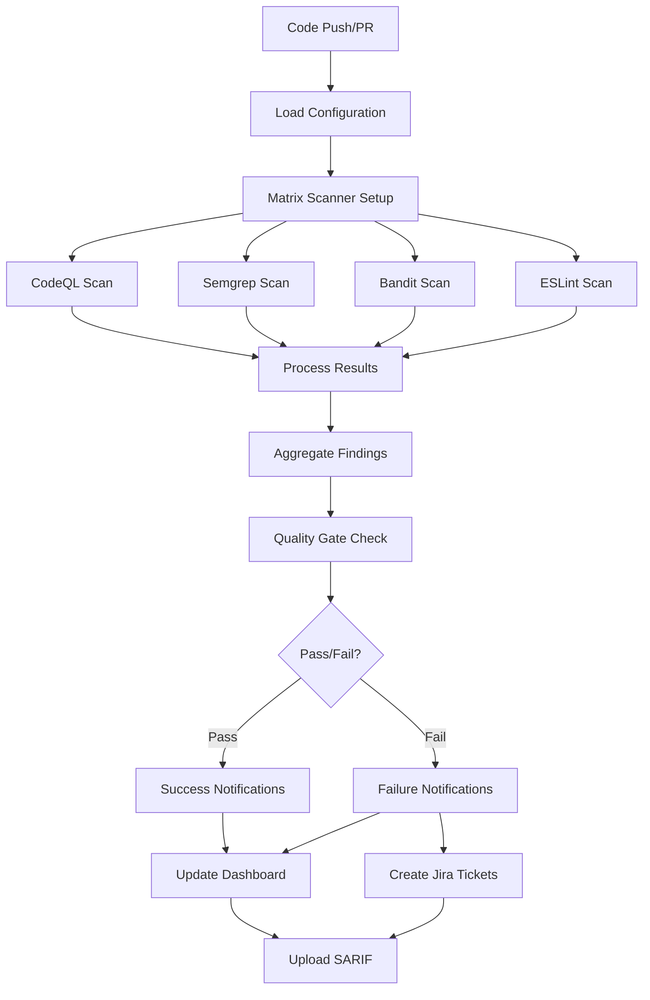
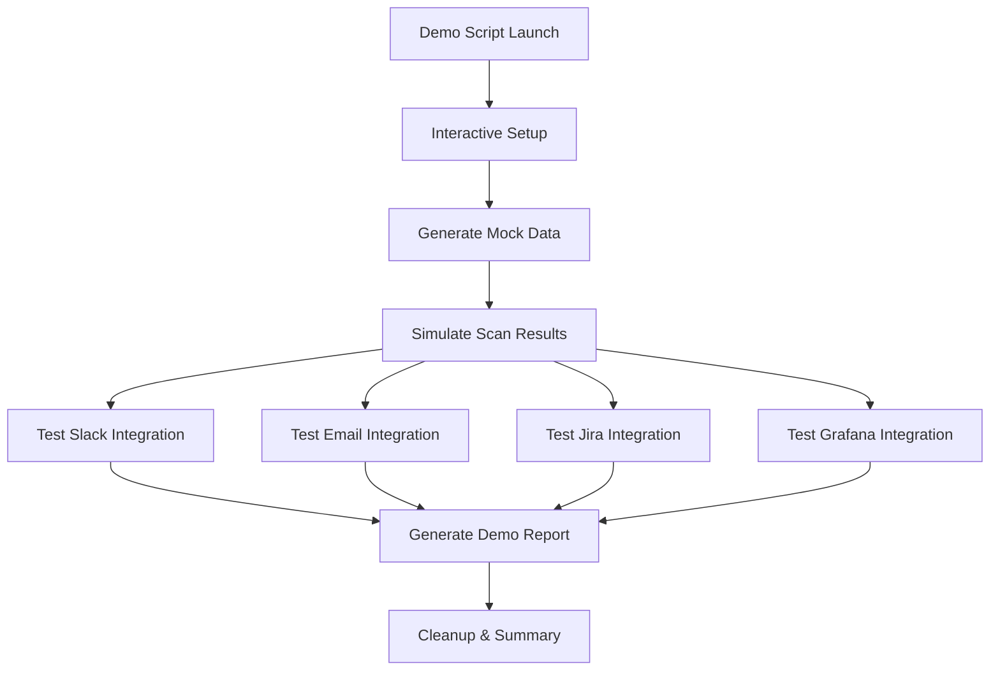

# 🏗️ System Architecture

This document describes the architecture and design principles of the CI/CD SAST Security Boilerplate.

## 🎯 Overview

The CI/CD SAST Boilerplate is designed as a comprehensive, production-ready security scanning solution that can be easily integrated into any development workflow. The architecture follows DevSecOps best practices with security-by-design principles.

## 🧱 Core Components

### 1. Configuration Management Layer

```
ci-config.yaml (Central Configuration)
    ├── Project Settings
    ├── SAST Scanner Configuration
    ├── Notification Rules
    ├── Integration Endpoints
    ├── Pipeline Behavior
    └── Environment Overrides
```

**Key Features:**
- Single source of truth for all configurations
- Environment-specific overrides
- Validation and schema enforcement
- Version control friendly (YAML format)

### 2. Scanning Engine Layer

```
SAST Scanners (Matrix Strategy)
    ├── CodeQL (Semantic Analysis)
    ├── Semgrep (Pattern Matching)
    ├── Bandit (Python Security)
    ├── ESLint Security (JS/TS)
    └── [Extensible for more scanners]
```

**Capabilities:**
- Multi-language support
- Parallel execution
- Configurable severity thresholds
- Custom rule integration
- Results normalization

### 3. Processing & Analysis Layer

```
Results Processing Pipeline
    ├── Raw Scanner Output
    ├── Format Conversion (SARIF)
    ├── Vulnerability Aggregation
    ├── Severity Classification
    ├── Threshold Evaluation
    └── Status Determination
```

**Processing Features:**
- SARIF standardization
- Duplicate removal
- False positive filtering
- Risk scoring
- Quality gate evaluation

### 4. Notification & Integration Layer

```
Multi-Channel Notifications
    ├── Slack (Real-time alerts)
    ├── Email (Formal notifications)
    ├── Jira (Issue tracking)
    ├── Teams (Microsoft ecosystem)
    └── Grafana (Metrics & dashboards)
```

**Integration Features:**
- Conditional notifications
- Rich message formatting
- Automatic ticket creation
- Metrics collection
- Dashboard updates

### 5. Demo & Testing Layer

```
Demo Mode System
    ├── Simulated Vulnerability Data
    ├── Mock Integration Calls
    ├── Safe Testing Environment
    ├── Interactive Configuration
    └── Validation Reports
```

## 🔄 Workflow Architecture

### Standard Security Scan Flow



### Demo Mode Flow



## 🏗️ Design Principles

### 1. Security by Design

- **Principle**: Security integrated throughout the development lifecycle
- **Implementation**: 
  - Automated security scanning on every commit
  - Fail-fast on critical vulnerabilities
  - Continuous monitoring and alerting

### 2. Configuration as Code

- **Principle**: All configuration managed through version control
- **Implementation**:
  - Central YAML configuration file
  - Environment-specific overrides
  - Validation and schema enforcement

### 3. Fail-Safe Defaults

- **Principle**: Secure defaults with explicit opt-out
- **Implementation**:
  - Conservative security thresholds
  - Enabled notifications by default
  - Comprehensive scanning by default

### 4. Separation of Concerns

- **Principle**: Each component has a single responsibility
- **Implementation**:
  - Scanning logic separated from notification logic
  - Configuration management isolated
  - Demo mode completely separate from production

### 5. Extensibility

- **Principle**: Easy to add new scanners and integrations
- **Implementation**:
  - Modular scanner architecture
  - Standardized interfaces
  - Plugin-style integration points

## 🔧 Technical Implementation

### GitHub Actions Integration

```yaml
# Workflow Structure
workflows/
├── sast-security-scan.yml    # Main security scanning
└── ci-pipeline.yml           # Complete CI/CD pipeline

# Job Dependencies
load-config → sast-scan → [notify-results, update-dashboard]
                      → [quality-gates, artifact-upload]
```

### Script Architecture

```bash
scripts/
├── process_results.sh        # Results aggregation & processing
├── send_notifications.sh     # Multi-channel notifications
├── update_grafana.sh         # Dashboard & metrics updates
└── [Scanner-specific scripts]
```

### Configuration Schema

```yaml
# Hierarchical Configuration Structure
ci-config.yaml
├── project: {}              # Project metadata
├── sast: {}                 # Scanner configuration
├── notifications: {}        # Notification rules
├── integrations: {}         # External integrations
├── pipeline: {}             # Workflow behavior
├── security: {}             # Security policies
├── reporting: {}            # Report generation
├── demo_mode: {}            # Demo configuration
└── environments: {}         # Environment overrides
```

## 🚀 Deployment Architecture

### Repository Structure

```
CI SAST Boilerplate Repository
├── Production Workflows (.github/workflows/)
├── Configuration Templates (configs/)
├── Processing Scripts (scripts/)
├── Documentation (docs/)
├── Examples & Tests (examples/)
└── Demo Infrastructure (run_demo.sh)
```

### Integration Patterns

#### Pattern 1: Direct Integration
```yaml
# Use workflows directly in target repository
jobs:
  security:
    uses: org/ci-sast-boilerplate/.github/workflows/sast-security-scan.yml@main
```

#### Pattern 2: Template Copy
```bash
# Copy boilerplate to new repository
git clone ci-sast-boilerplate my-project-security
# Customize configuration
# Push to target repository
```

#### Pattern 3: Centralized Service
```yaml
# Call centralized security service
jobs:
  security:
    uses: security-team/central-sast-service@main
    with:
      repository: ${{ github.repository }}
```

## 📊 Data Flow Architecture

### Configuration Flow

```
ci-config.yaml → yq parser → JSON → Environment Variables → Scripts
```

### Results Flow

```
Scanner Output → SARIF Conversion → Aggregation → Processing → Notifications
                                                            → Dashboard Updates
                                                            → Artifact Storage
```

### Notification Flow

```
Trigger Event → Configuration Check → Message Generation → Channel Delivery
              → Threshold Evaluation → Content Formatting → Parallel Sending
```

## 🔒 Security Architecture

### Secrets Management

```
GitHub Secrets (Encrypted at Rest)
├── SLACK_WEBHOOK
├── EMAIL_SMTP_PASSWORD
├── JIRA_API_TOKEN
├── GRAFANA_API_KEY
└── [Scanner-specific tokens]
```

### Network Security

```
HTTPS/TLS Encrypted Communications
├── Webhook Endpoints (Slack, Teams)
├── API Endpoints (Jira, Grafana)
├── SMTP Connections (Email)
└── Scanner Services (Semgrep, etc.)
```

### Access Control

```
GitHub Repository Permissions
├── Actions: Read/Write (Workflow execution)
├── Security Events: Write (SARIF upload)
├── Repository: Read (Code access)
└── Secrets: Read (Integration tokens)
```

## 📈 Scalability Considerations

### Horizontal Scaling

- **Matrix Strategy**: Parallel scanner execution
- **Multi-Repository**: Same workflows across multiple projects
- **Load Distribution**: Scheduled scans spread across time

### Performance Optimization

- **Caching**: Dependencies and scan results
- **Incremental Scanning**: Only changed files when possible
- **Resource Limits**: Timeouts and resource allocation

### Monitoring & Observability

- **Workflow Metrics**: Execution time and success rates
- **Scanner Performance**: Individual scanner metrics
- **Integration Health**: Notification delivery rates

## 🔮 Future Architecture

### Planned Enhancements

1. **Scanner Plugins**: Dynamic scanner loading
2. **Custom Rules Engine**: User-defined security rules
3. **ML-Based Analysis**: AI-powered vulnerability detection
4. **Multi-Cloud Support**: AWS, Azure, GCP integrations
5. **Advanced Reporting**: Trend analysis and forecasting

### Migration Path

```
Current (v1.0) → Enhanced (v1.1) → Advanced (v2.0) → ML-Powered (v3.0)
                ↓                  ↓                 ↓
          Plugin System    →  Custom Rules   →  AI Analysis
          Cloud Metrics    →  Advanced UI    →  Predictive
          API Gateway      →  Multi-tenant   →  Auto-remediation
```

---

This architecture supports the core mission of providing a production-ready, secure, and extensible CI/CD security scanning solution that can adapt to diverse organizational needs while maintaining security best practices.
